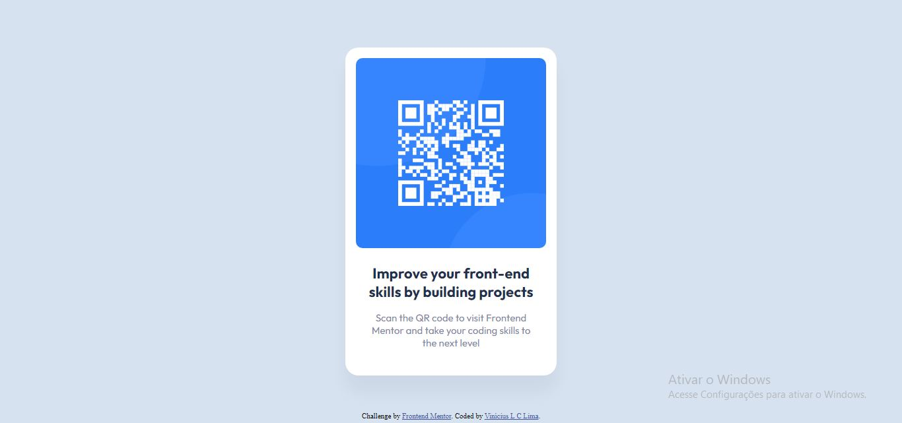

# Frontend Mentor - QR code component solution

This is a solution to the [QR code component challenge on Frontend Mentor](https://www.frontendmentor.io/challenges/qr-code-component-iux_sIO_H). Frontend Mentor challenges help you improve your coding skills by building realistic projects. 

## Table of contents

- [Overview](#overview)
  - [Screenshot](#screenshot)
  - [Links](#links)
- [My process](#my-process)
  - [Built with](#built-with)
  - [How it was implemented](#how-it-was-implemented)
- [Author](#author)

## Overview

### Screenshot

### Links

- Solution URL: [Add solution URL here](https://your-solution-url.com)
- Live Site URL: [Add live site URL here](https://your-live-site-url.com)

## My process

### Built with

- Semantic HTML5 markup
- CSS custom properties
- Flexbox

### How it was implemented
This was a very simple project I've turned to life from the design file provided by Frontend Mentor for this challenge.
Completing it was just a matter of structuring the page through HTML semantic tags and positioning, dimensioning and styling elements according to the design file through CSS properties.

## Author

<!-- - Website - [Add your name here](https://www.your-site.com) -->
- Frontend Mentor - [@ViniciusLCLima](https://www.frontendmentor.io/profile/ViniciusLCLima)
